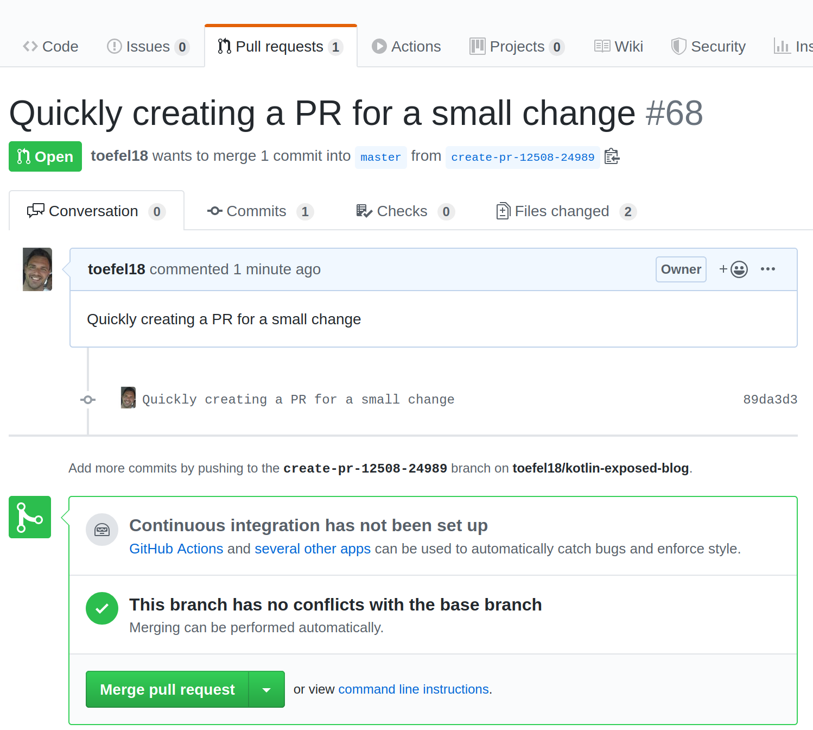

# create-pr

Simple bash script that creates a PR from your current staging area!


Example: 2 files changed, but only README.md is added to staging area
```bash
$ git st
  On branch master
  Your branch is up to date with 'origin/master'.
  
  Changes to be committed:
    (use "git reset HEAD <file>..." to unstage)
  
  	modified:   README.MD
  
  Changes not staged for commit:
    (use "git add <file>..." to update what will be committed)
    (use "git checkout -- <file>..." to discard changes in working directory)
  
  	modified:   build.gradle
```

At this point, you can simply run `create-pr` to create a PR for README.md.
You can optionally provide a commit message, for example `create-pr -m "TICKET-S964 updated versions"` or it will 
default to `quick pr`.

```bash
$ create-pr -asm "Quickly creating a PR for a small change"

  you are currently on master
  on master, creating a new branch create-pr-12508-24989
  M	README.md
  Switched to a new branch 'create-pr-12508-24989'
  Committing all files with message Quickly creating a PR for a small change
  [create-pr-12508-24989 89da3d3] Quickly creating a PR for a small change
   2 files changed, 119 insertions(+), 1 deletion(-)
   create mode 100644 unstaged-file.txt
  Counting objects: 3, done.
  Delta compression using up to 12 threads.
  Compressing objects: 100% (3/3), done.
  Writing objects: 100% (3/3), 361 bytes | 361.00 KiB/s, done.
  Total 3 (delta 2), reused 0 (delta 0)
  remote: Resolving deltas: 100% (2/2), completed with 2 local objects.
  remote: 
  remote: Create a pull request for 'create-pr-12508-24989' on GitHub by visiting:
  remote:      https://github.com/toefel18/kotlin-exposed-blog/pull/new/create-pr-12508-24989
  remote: 
  To github.com:toefel18/kotlin-exposed-blog.git
   * [new branch]      HEAD -> create-pr-12508-24989
  
  Creating pull request for create-pr-12508-24989 into master in toefel18/kotlin-exposed-blog
  
  created PR 68, opening browser
  Opening https://github.com/toefel18/kotlin-exposed-blog/pull/68 in your browser.
  Switching back to master
  To checkout the branch from which the PR was made, use:
  
     git checkout create-pr-12508-24989
  
  Switched to branch 'master'
  Your branch is up to date with 'origin/master'.

```

The PR will be created and your browser will be opened automatically!



#### Supported options:

 * `-a` adds all changes, including new files, to the staging area before creating the PR
 * `-s` switches back to master after the PR is created, so you can start with a clean slate for next small change
 * `-m` provides a commit message, that message will also be in the PR body in github 

# Installation

1. Install github cli: https://cli.github.com/manual/installation

1. Clone this REPO somewhere
       
       cd $HOME
       git clone https://github.com/toefel18/create-pr.git 
       
1. Add the bin folder to your PATH (save this in .bashrc)

       PATH=$PATH:$HOME/create-pr/bin
       
